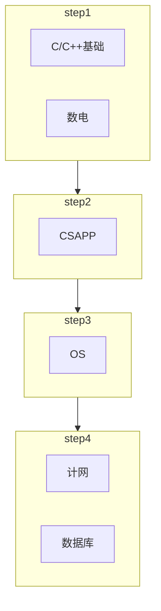

# 何为CS
**计算机科学**（英语：**computer science**，缩写为**CS**）是系统性研究信息与计算的理论基础以及它们在计算机系统中如何实现与应用的实用技术的学科（其包括了各类的计算机软硬件，网络，数据库）。

有时公众会误以为计算机科学就是解决计算机问题的事业（比如信息技术），或者只是与使用计算机的经验有关，如玩游戏、上网或者文字处理。其实计算机科学所关注的，不仅仅是去理解实现类似游戏、浏览器这些软件的程序的性质，更要通过现有的知识创造新的程序或者改进已有的程序，设计和实现更好的计算机系统、软硬件产品，推动信息社会和智能社会发展。

# 硬件工具相关

如果你买的苹果笔记本，那么请看一下是不是intelx86兼容芯片组（新版苹果已经完全脱离intel了），如果是M1或者M2，那么建议你再准备一台 X86 平台的电脑。不然你后面的很多课程实验将没有办法完成（虽然苹果现在有虚拟机可以完成实验，但我想你应该不会去费力的配置）。

（部分软件强依赖于X86平台和Windows系统，ARM和Risc-V平台或者其他操作系统可能出现无法安装，甚至没有替代产品的情况）

完成本科学习的电脑配置不需要太高：
CPU有8线程即可（4核心）
有独立显卡保证8G内存，无独立显卡保证16G内存即可
电池要稍微耐用一点，省电模式3个小时以上，学校晚上11点停电，别说你大学四年完全不会半夜起来赶作业
硬盘512G完全够用

（我现在小黄鱼上捡的二手ThinkPad X395用的非常舒服）

当然，打游戏另说

# 一盆冷水

如果认为学习的计算机科学只是一个你为了玩游戏而胡乱选择的专业，而对于其本身的发展不感兴趣，那么你就已经可以开始考虑转专业了。

又或者说，你是随波逐流，**听说**计算机专业有广阔的就业场景，那么不好意思，目前的就业形势并不是处在几年前或者十几年前那样互联网行业高速发展的红利期。如今找一份满意的工作，或许比各位想象的要困难许多。

现阶段你唯一能做的就是不断学习，扩展自身的知识面和深度。

# 如何学习
学习计算机最重要的几件事：
1. **RTFM**（read the friendly manual）
2. **FTFW**（find the friendly website）

为什么这里强调手册的重要性呢，就是因为目前的论坛或者博客（某些屎山网站），大家都是根据经验解决问题，通常没有仔细思考过内部的运行原理。而这时，一份官方的文档就能解答你的所有疑惑（如果官方文档都没有解释的东西，那么又有谁会知道呢？）

你有权利相信，你的所有疑惑都会在阅读文档中迎刃而解

同时这里推荐几个网站：
[C++官方参考](https://en.cppreference.com/w/)
[IOwiki-一个专门讲解各种竞赛算法的网站](https://oi-wiki.org/)
[提升CS技能的网站](https://csdiy.wiki/)
[StackOverFlow-一个程序员聚集的地方](https://stackoverflow.com/)
[GitHub-俗称GayHub，全球最大代码托管平台](https://github.com/)
永远不能忘记的Linux/UNIX **man** 指令(在WSL同样好用！)

第一次点开你可能会发现，很多内容都是英文的，你会觉得难以阅读或者理解，希望能有一份中文的文档，不过很遗憾，你不得不承认，中国与以美国为首的最先引入个人PC机的国家确实有着不小的差距。落后就要挨打，所以文档不得不向着英文发展。

虽然过程可能相当痛苦，不过当你阅读完文档之后，相信你能够找到让自己满意的答案。

请记住，计算机科学是一个庞大学科，没有任何一个人能够回答你的所有问题，甚至你的专业课老师都有可能一直使用错误的方法在为大家讲解（我也不例外，如果在讲解中有任何错误，欢迎各位大佬及时指出）。所以在你遇到困难的时候，请记住，你的**第一件事就是去寻找对应的手册，然后阅读其中你所需要的内容**。

## 关于魔法的使用

受限于国内的网络环境，你在深入学习的过程中式需要一些**魔法**的帮助的，无论你是使用商业化的软件，亦或是租用境外服务器自己配置。

总之准备一个安全好用的**魔法**软件是深入学习必要的。

受限于政策以及法律原因，这里就不做过多赘述。

# CS科技树
另一个大家关心问题就是大学中计算机科学的科技树是如何点亮的

这里就列出为**分方向前的专业课科技树**（大一大二）
![[科技树.png]]

建议学习步骤



# C/C++一切的大前提

在了解C/C++之前，我们应该去了解一下编程语言以及计算机的发展历史

## 计算机发展史

### 第一代计算机（46-57）

第一台计算机：ENIAC（没有编程语言，纯粹的硬电路连接实现计算）
![[w0.ENIAC.jpeg]]
世界上第一台电子计算机，占地170平方米，重达30吨，耗电功率约150千瓦，每秒钟仅仅可进行5000次运算。（不足现在计算机的百万分之一）
被美国国防部用来进行弹道计算。

为什么现在程序出现问题叫做BUG，其实有这一段历史因素
![[w0.bug.png]]

### 第二代计算机（58-64）

这个时候由于晶体管的发展，计算机的硬件部分逐渐由体积大，发热高的电子管转变为晶体管，体积大大缩小，性能大大提高，且耗电量大为降低，可靠性大大提高了。

同时，这个阶段还出现了编程语言
Fortran——1954
LISP——1958
Cobol——1959
SImula——1962
Basic，Pascal，C三大经典

### 第三代计算机（65-70）

1958年德州仪器的工程师Jack Kilby发明了集成电路(IC)，将三种电子元件结合到一片小小的硅片上。更多的元件集成到单一的半导体芯片上，计算机变得更小，功耗更低，速度更快。

这时的计算机时钟已经可以到达MHz了！这个性能足以运行操作系统！

并且这时有一个震惊世界的大事件：人类第一次登上了月球
Apollo飞船上也有一个计算机——AGC（apollo guidance computer）
![[w0.AGC.png]]
虽然这只是计算机的显示器，本体还是要大得多，不过也只有一个抽屉那么大（这在当年就是外星科技）

[AGC模拟器](https://svtsim.com/moonjs/agc.html)

### 第四代计算机（71-至今）

大规模超大规模集成电路计算机
操作系统、编程语言日渐成熟，软件生态优良，计算机成本大幅下降，计算机得以来到我们每个人手中

现在的计算机已经不仅仅满足于专用应用，还得益于实时系统的发展，我们可以完成很多有趣的事情，比如可以让彬彬愉快的打电动
![[w0.binbin.png]]

历史大事件：
1. Intel 8086处理器，一举将速度提升到10MHz，总线提升到16位，并且可以支持1M内存。同时8086是Intel最成功的处理器系列x86架构的开端，这也是Intel始料未及的。
2. AMD64位指令集，x64于1999年由AMD设计，AMD首次公开64位集以扩展给x86，称为“AMD64”。其后也为英特尔所采用，现时英特尔称之为“Intel 64”，在之前曾使用过“Clackamas Technology” (CT)、“IA-32e”及“EM64T”。（这也就是有的时候你去下载软件可以看到x86-amd64字样，这不是专用于amd的软件版本，而是64位的版本）

## 为什么要学习计算机语言

机器码
![[w0HEXcode.png]]
汇编
![[w0.ASM.png]]
C语言
![[w0.C.png]]
（分别截取自hexdump、gdb、vim）

可以看到，同样的一份代码，机器码没有办法阅读，汇编勉强具有可读性，C语言则清晰易懂（有更加简单的，谁会和自己过不去呢？）

另一个C语言强大的地方就是它可以直接与硬件交互，而不依赖与奇奇怪怪的运行时和虚拟机，并且它和直接写汇编直接的效率损耗只有10%左右，非常高效

而C++相较于C语言，提供了强大的面向对象特性，并且由丰富的STL来简化代码

在本次课程中，我们主要学习C++的编码风格（抛开OOP特性，两者非常相似）

## 一份代码到可执行程序的旅程

我们写好的程序通常仅仅是一个文本文件，那么他是怎么运行的呢？

这就涉及到编译这一关键步骤

~~众所周知~~，我们的 c 代码可以由 gcc 编译器编译为可执行程序，而-save-temps选项可以让我们看见所有的编译中间文件

那么我们就可以来查看一份源文件的整个编译过程（Linux下）
```bash
┌[holo☮ubuntu2004]-(~)
└> ls
hello.c
┌[holo☮ubuntu2004]-(~)
└> gcc hello.c -save-temps -o hello.out
┌[holo☮ubuntu2004]-(~)
└> ll
total 48K
-rw-rw-r-- 1 holo holo   71 Jul 29 10:36 hello.c
-rw-rw-r-- 1 holo holo  16K Jul 30 06:11 hello.i
-rw-rw-r-- 1 holo holo 1.7K Jul 30 06:11 hello.o
-rwxrwxr-x 1 holo holo  17K Jul 30 06:11 hello.out
-rw-rw-r-- 1 holo holo  654 Jul 30 06:11 hello.s
```

可以看到，在经历过编译过程后，我们不仅得到了一个可以执行的hello.out文件，而且还得到了三个后缀为 ** .i .o .s ** 的文件

我们可以查看这几个文件

可以发现编译过程如下：


```sh
┌[holo☮ubuntu2004]-(~)
└> file hello.c
hello.c: C source, ASCII text
┌[holo☮ubuntu2004]-(~)
└> file hello.i
hello.i: C source, ASCII text
┌[holo☮ubuntu2004]-(~)
└> file hello.s
hello.s: assembler source, ASCII text
┌[holo☮ubuntu2004]-(~)
└> file hello.o
hello.o: ELF 64-bit LSB relocatable, x86-64, version 1 (SYSV), not stripped
┌[holo☮ubuntu2004]-(~)
└> file hello.out
hello.out: ELF 64-bit LSB shared object, x86-64, version 1 (SYSV), dynamically linked, BuildID[sha1]=a2299bbf4bc6acc6bc4836da1d19f40ba9aae069, not stripped
```

# 推荐的编译器

## 傻瓜式一键操作

### DEV-Cpp
![[w0.DEVC++.png]]

对于初学者来说，应该是最方便上手的编辑器，直接<kbd>Ctrl</kbd>+<kbd>n</kbd>新建一个源文件，<kbd>F11</kbd>即可运行，<kbd>F5</kbd>即可调试

整体来说非常方便

不过一个致命缺点就是原作者已经相当长一段时间没有维护了，软件的编译器版本非常老旧

### Code::Blocks
![[w0.CodeBlocks.png]]

整体来说相较于DEV操作要复杂一些，要获得完整体验就必须新建项目，菜单选项过多，不便于定位。不过这是所有比赛都认定的编译器，学校期末考试也是这个（个别机器会有DEV）

整体来说，还是很不错的，但是相对于DEV来说学习成本稍高

## 折腾型

### 我自己用的方案（生命不息，折腾不止）

Windows：
	MSYS2的C++开发工具链 & VScode
Linux：
	ssh
	gcc/g++/gdb
	vim
	vscode
	make
	git

（严格来说，这里的MSYS2的开发工具链和GCC、G++才叫做编译器，上述的DEV、CB叫做IDE，不过这里就懒得区分了，dddd）

使用这个工具的好处就是，你可以让你的工具永远保持着最新的状态
![[w0.windowsENV.png]]
![[w0.LinuxENV.png]]

此外，我以后的课程是使用Linux环境，搭配tmux、vim、g++

为什么选择这一套配置？原因就是去年太多同学跟着我去搞vscode，然后不会配置，所以这次直接就整点你们不会的（至少Linux就可以劝退大部人对于这个环境的向往吧？），让你们乖乖去用DEV和CB

## 不推荐型

通常的来说，看着就很重型的 IDE 环境都不适合初学者使用，VS就是一个典型代表

### Visual Studio

过于重型，开发大型项目或许很方便，但是写小程序代码反而显得很累赘

而且MSVC行为和MinGW G++，GNU G++不太一样

典型的就是代码bug调试的时候输出：
锟斤拷烫烫烫烫烫烫烫烫烫烫烫烫烫烫烫烫烫烫烫烫烫烫烫烫烫屯屯屯屯屯屯屯屯屯屯屯屯屯屯屯屯屯屯屯屯屯屯屯屯屯屯屯

“锟斤拷”乱码源于GBK字符集和Unicode字符集之间的转换问题。
Visual Studio中，未初始化的栈空间用0xCC填充，而未初始化的堆空间用0xCD填充，而在GBK编码中0xCCCC和0xCDCD刚好对应“烫”字和“屯”字。

### clion

CLion是Jetbrains公司旗下新推出的一款专为开发C/C++所设计的跨平台IDE,它是以IntelliJ为基础设计的,同时还包含了许多智能功能来提高开发人员的生产力

![[Clion.png]]

我没有使用过，不做过多的评价（打工人学长说很好用），不过看起来就很重型，而且是付费软件，寻找对应的“教po育jie版”不在我们的教学范围内

# 提问的正确姿势

为了方便我们回答，提问时候请遵循以下原则：

- 使用截图，不要用手机照相（qq截屏或者windows自带截屏<kbd>shift</kbd>+<kbd>win</kbd>+<kbd>s</kbd>都可以）
- 描述问题要一句话说完，不要每次只发一两个词，这样我们看起来很麻烦
- 如果代码不能运行，那么把代码和报错也一并发出
- 群内不要直接粘贴代码，粘贴代码请使用[UbuntuPasteBin](https://pastebin.ubuntu.com/)

例子：

你的代码长这样
```cpp
#include <cstdio>
using namespace std;

int mian()
{
    printf("Hello World");
    return 0;
}
```

你发现无法编译，那么你的提问应该是这样的：

![[Pasted image 20220826183503.png]]
我的代码目前无法编译，这是代码截图和报错信息，请问是那里的问题

我们一般会这样回答你：

主函数写错成了mian

当代码太长的时候，你可以使用上述的UbuntuPasteBin，这样你会得到一个网址，直接发出这个网址我们就可以看见你的代码了，会很方便

不过任何人给你说的都不一定全面且正确，要获得完全正确的知识，还得去寻找对应的官方手册

# 最后一点话

知识永远不是别人教你的，永远是自己去学习的

即使你有世界一流的教师团队，但是自己却是一个混子，那也一样一事无成

最后就是去年给新生讲课也说过的一句话：**想学？那还不简单吗！**

（下次开始就是真正进入到C++语法的学习了）