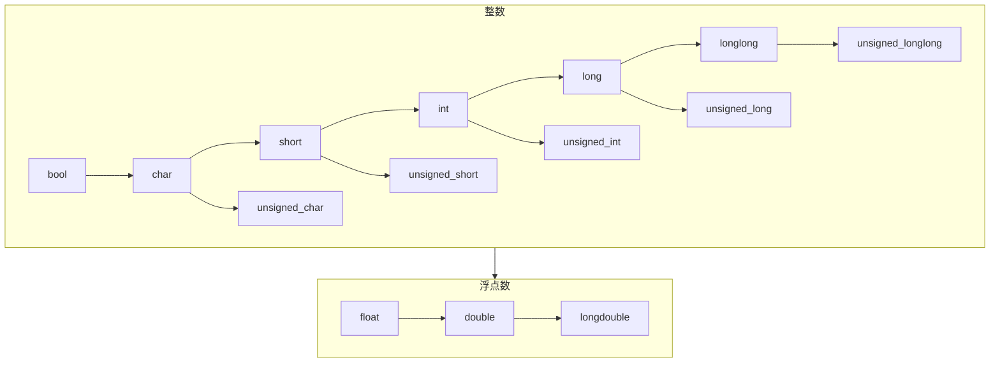

# 变量

就如同数学公式一样，我们程序在运行中需要一个能够存储数据的容器

这个容器就被我们称为是变量

# 变量类型

在C/C++中，整数，浮点数（小数），字符，字符串，真假关系等都能够用变量来进行存储

但是这些变量的特点是不一样的，所以我们对于不同的变量需要使用不同的变量类型

例如，我们存储一个小数，可以使用浮点类型的变量，存储一个整数可以使用整数类型变量，存储一个关系的真假，可以使用布尔类型而变量

当然，各个变量由于存储的数据不同，其占据的内存空间也是不同的

在**X86-64，windows10 21H2 专业工作站版本，GCC 12.1.0**环境下为例，各个变量类型以及其所占空间我们在这里以表格形式给出

为什么交代的这么详细，因为GNU只规定了最小，而没有规定最大，CPU架构，系统版本，GCC环境都有**可能影响**具体的情况（虽然大部分还是按照POSIX标准制定的）

| 类型 | 作用 | 容量(至少) | 最大值 | 最小值 |
|---|---|---|---|---|
| char | 字符和小整数 | 8Bit | 2^7-1 | -(2^7) |
| short | 整数 | 16Bit | 2^15-1 | -(2^15) |
| long | 整数 | 32Bit | 2^31-1 | -(2^31) |
| int | 整数 | 32Bit | 2^31-1 | -(2^31) |
| long long | 整数 | 64Bit | 2^63-1 | -(2^63) |
| float | 浮点数(小数) | 32Bit | 3.4E+38 | -3.4E+38 |
| double | 浮点数(小数) | 64Bit | 1.7E+308 | -1.7E+308 |
| long double | 浮点数(小数) | 128Bit | 1.2E+4932 | -1.2E+4932 |
| bool | 真假关系 | 8Bit | 真(非0) | 假(0) |

[更加详细的介绍](https://en.cppreference.com/w/cpp/language/types)

如果你想使用确定位数的变量，那么可以选择stdint.h头文件中的：
- int8_t
- int16_t
- int32_t
- int64_t
- ....

## 无符号限定符

上述变量类型中，整数都是带有负数部分的

在实际问题中，我么又是需要的变量不会包含负数部分

这时，我们可以在相关变量前面部分添加unsigned关键字，使其转变为无符号类型，并且其能表示的最小值变为0，最大值变为2^n-1

这样的变量有

unsigned char
unsigned int
unsigned long
unsigned long long
unsigned（本身就表示unsigned int）

**注意，浮点类型总是带有符号的**

## 常量限定符

在我们的程序中，我们希望有的东西恒定的，只要我们规定了它等于多少，后续就不能更改

某一些值我们是不希望其改变的，例如 $\pi$ 的值，又或者地球重力加速度的值 $G$

这时候我么只需在这个变量前面加上const即可使其变为一个常量，常量值允许在被定义的时候赋予初值，此后不能再被改变

例如我们可以使用下列语句定义常量

```cpp
const int hop = 170001;
const double PI = 3.14;
```

# 变量的输入与输出

这里主要讲解输入输出格式化的方式

详细可以参考Linux下的 man 3 printf 和 man scanf

## %d

用于char/int/short/long
```cpp
// 变量定义：
    short a;
    int b;
    long c;
// 输入：
    scanf("%d", &a);
// 输出：
    printf("%d", b);
```

## %lld

用于long long
```cpp
// 变量定义：
    long long a; 
// 输入：
    scanf("%lld", &a);
// 输出：
    printf("%lld", a);
```

## %c

用于char（字符）
```cpp
// 变量定义：
    char c; 
// 输入：
    scanf("%c", &c);
// 输出：
    printf("%c", c);
```

## %s

用于char（字符串）
```cpp
// 变量定义：
    char s[100]; 
// 输入：
    scanf("%s", s);
// 输出：
    printf("%s", s);
```

为什么这里的s在读入时没有使用取地址符，会在下一节数组中讲解

## %f %lf %Lf

用于float，double
```cpp
// 变量定义：
    float a;
    double b;
    long double c;
// 输入：
    scanf("%f%lf%Lf", &a, &b, &c);
// 输出：
    printf("%f %f %Lf", a, b, c);
```

对于float类型，输入输出都是%f
对于double输入是%lf，输出是%f
对于long double输入是%Lf，输出是%Lf

请一定按照规定读入和输出，double在printf中使用lf输出是**未定义行为**，其有**可能发生任何后果**，比如执行后打开你的浏览器开始播放奥特曼
![[undefined behavior.jpg]]

## %

当我们想要原封不动的输出一个%d时，显然不能使用以下代码

```cpp
printf("%d");
```

因为这告诉了编译器这个地方将会被填上一个整数

那么我们就可以使用%\%原封不动的输出百分号，然后再输出一个d即可

```cpp
printf("%%d");
```

## 字符的实际存储方式

众所周知，在计算机中，一切数据都是以二进制形式存储的

也就是数字的形式

而对于字符，计算机其实也是通过某种规则来将这些东西转换为了数字来表示

这一套规则称为ASCII码
![[ASCLL table.png]]

可以看到，每一个英文字符和控制字符都能对应到唯一二进制值，这样，我们就能将一个字符转化为数字，也可以将一个数字转化为字符

[ASCLL表](https://en.cppreference.com/w/cpp/language/ascii)

# 字符的转义

在上面描述了如何格式化输出变量/常量，那么如果我们就像要让输出换行真么办？或者输出一个tab怎么办呢？

## Escape character

这个东西叫做转义字符，有时也被叫做逃逸字符（翻译方式不一样而已）

其目的就是用来表示常见的那些不能显示的ASCII字符，如\\0,\\t,\\n等

其以'\\'开始，后面跟随一个被定义的字符或者一个字符ASCLL码对应的八/十六进制数字来输出（一般来说，我们只会用到那些被定义的字符）

字符表：
| 转义字符 | 意义 |
|---|---|
| \\a | 响铃 |
| \\b | 退格 |
| \\f | 换页 |
| \\n | 换行 |
| \\r | 回车 |
| \\t | 水平制表(tab) |
| \\v | 垂直制表 |
| \\\\ | 输出反斜线 |
| \\\' | 输出单引号 |
| \\\" | 输出双引号 |
| \\? | 输出问号 |
| \\0 | 空字符 |
| \\ddd | 八进制代表的字符 |
| \\xhh | 十六进制代表的字符 |

其实你会发现，用的最多的就是"\\n"和"\\\\"了，其他转义字符基本不会使用，而"\\n"你们应该相当熟悉了

### 科普——换行和回车

在计算机发展之前，其实就已经有了键盘这个概念——打字机
![[Pasted image 20220824191139.png]]

在机械英文打字机上，有一个部件叫“字车”，每打一个单词，“字车”就前进一格

在手动打字机上，一行文字被完全占满所需要的动作就是将字车推回到最左边，以方便下一行的开始，于是就有了**回车**的概念。而需要切换到新的一行，你可以将打字机的滚筒向上卷一行，来达到换行的目的，于是就有了**换行**的概念。（当然，有些打字机在回车时自动换行）

而在后面使用的电传打字机中，每秒可以传输10个字符，而回车+换行一共需要0.2秒，要是在这0.2秒里面，又有新的字符传过来，那么这个字符将丢失。于是研究人员就特意将换行与回车的概念单独分离，迎来填补这0.2秒的时间差（控制字符，不参与打印）

# 类型的转化

### 显示转化

显式转化，其方式是在想要转化的变量前面写上需要转化成的变量类型，例如
```cpp
	long long a = 1LL;
    short b = (short)a;
```
这种转化没有隐藏规则，你怎么写，程序怎么转化

### 隐式转化

另一种叫做隐式转化，其在某些时候可以省略前面的目标变量类型，由编译器自行确定转化方式，例如
```cpp
    long long a = 1LL;
    short b = a;
```
这里由 a 到 b 的转化就叫隐式转化

在C++中，隐式转化遵循以下基本规则
1.低级向高级转化
2.同级向内存空间大的转化
3.同等级的有符号向无符号转化

具体来说是这样的


例如
Int在和double类型做运算时，会隐式转化为double，而不会转化为int或者float

隐式转化只能发生在对于变量进行某种运算的时候

这种运算包括简单的四则运算，赋值运算，比较等时候

# 数值运算

## 运算符的元

在了解运算符优先级的时候，我们要理解运算符的元

在C/C++中，一个运算符作用的表达式的数量，我们称为这个运算的元

例如，对于一个普通加法而言，显然要对两个表达式进行计算，那么这个运算符就是二元的

又如，我们要对一个值取反，可以在其前面添加‘-’号，那么这个负号作用的对象只有一个，其就只一元的

## 赋值运算（=）

在C/C++中，赋值运算符是等号，其包含等号左右两个部分
左边一定是一个变量，右边可以是一个常量、变量或者表达式

```cpp
    a = 10;
    a = b;
    a = b + c;
```

## 加法运算（+）

在C/C++中，加法运算有下列几种（已忽视变量定义）
```cpp
    a += 10;   //在a原来值的基础上加10
    a = b + c; //将b+c的值赋给a
    a++;       //a的值加上1
    ++a;       //a的值加上1
```

## 减法运算（-）

在C/C++中，减法运算有下列几种（已忽视变量定义）
```cpp
    a -= 10;   //在a原来值的基础上减10
    a = b - c; //将b-c的值赋给a
    a--;       //a的值减去1
    --a;       //a的值减去1
```

### 经典问题

```cpp
int i=1;
i=(++i)+(++i);
```

最终 i=6 ？？？

==错！这就是一个未定义行为，如果你在你的代码中写出了这种代码，那么你距离死亡就已经不远了==

虽然这里举例不是为了贬低某位老师或者学者，但是必须批评的是，未经求证的讲解是极为不负责任的体现！（我有时课件或者讲解出现的错误，大佬们如果知道一定要及时指出）

## 乘法运算（\*）

在C/C++中，乘法运算有下列几种（已忽视变量定义）
```cpp
    a *= 10;   //在a原来值的基础上乘10
    a = b * c; //将b乘c的值赋给a
```

## 除法运算（/）

在C/C++中，除法运算有下列几种（已忽视变量定义）
```cpp
    int a, b, c;
    a /= 10;   //在a原来值的基础上除10，并且舍去余数
    a = b / c; //将b除c的值赋给a，并且舍去余数

    double a, b, c;
    a /= 10;   //在a原来值的基础上除10，结果为小数
    a = b / c; //将b除c的值赋给a，结果为小数
```

## 求模计算（%，计算余数）

在C/C++中，取模运算有下列几种（只有整数才能取模，已忽视变量定义）
```cpp
    a %= 10;   //在a除10后取余数的值赋给a
    a = b % c; //将b除c后的余数赋给a
```

## 运算优先级

与数学相同，先乘除后加减，遇到括号先括号

# 逻辑运算

## 逻辑与（&&）

逻辑与计算的是两个表达式的真假关系

结果为真时当且仅当左右两个表达式的值都为真

(表达式a) && (表达式b)

| 表达式A | 表达式B | 结果 |
|---|---|---|
| 真 | 真 | 真 |
| 真 | 假 | 假 |
| 假 | 真 | 假 |
| 假 | 假 | 假 |

## 逻辑或（||）

逻辑与计算的是两个表达式的真假关系

结果为假时当且仅当左右两个表达式的值都为假

(表达式a) || (表达式b)

| 表达式A | 表达式B | 结果 |
|---|---|---|
| 真 | 真 | 真 |
| 真 | 假 | 真 |
| 假 | 真 | 真 |
| 假 | 假 | 假 |

## 逻辑非（!）

逻辑非计算的是一个表达式的真假关系

其结果真假关系与原表达式真假关系相反

!(表达式)

| 表达式 |结果 |
|---|---|
| 真 | 假 |
| 假 | 真 |

# 位运算

## 按位与（&）

对于两个变量的每一个二进制位执行与操作，位于位之间不影响

```txt
    000100101
&   011000101
=   000000101
```

```cpp
    a &= b;    //将a与上b，并将结果赋值给a
    a = b & c; //将b与上c，并将结果赋值给a
```

## 按位或（|）

对于两个变量的每一个二进制位执行或操作，位于位之间不影响
```txt
    000100101
|   011000101
=   011100101
```

```cpp
    a |= b;    //将a或上b，并将结果赋值给a
    a = b | c; //将b或上c，并将结果赋值给a
```

## 按位异或（^）

对于两个变量的每一个二进制位执行异或操作，位于位之间不影响
```txt
    000100101
^   011000101
=   011100000
```

```cpp
    a ^= b;    //将a异或上b，并将结果赋值给a
    a = b ^ c; //将b异或上c，并将结果赋值给a
```

## 按位取反（~）

对于两个变量的每一位执行取反操作，位于位之间不影响

```txt
~   011000101
=   100111010
```

```cpp
    ~a;    //将a的值按位取反，不改变a原来的值
```

## 左移（<<）

将二进制值全部向左移动，高位丢弃，低位补0
例如一个数的二进制值位为8位，值为10001011
```txt
左移零位就是	10001011
左移一位就是	00010110
左移两位就是	00101100
左移三位就是	01011000
```

```cpp
    a <<= b;      //将a左移b位，并将结果赋值给a
    a = (b << c); //将b左移c位，并将结果赋值给a
```

## 右移（>>）

区分算数和逻辑，这里只讲解逻辑运算(算数是补符号位)

将二进制值全部向右移动，低位丢弃，高位补0
例如一个数的二进制值位为8位，值为01110100

```txt
右移零位就是	01110100
右移一位就是	00111010
右移两位就是	00011101
右移三位就是	00001110
```

```cpp
    a >>= b;      //将a右移b位，并将结果赋值给a
    a = (b >> c); //将b右移c位，并将结果赋值给a
```

## 注意

使用逻辑运算符时应该特别注意优先级关系，由于其运算关系较为复杂，建议在使用时根据自己的目的合理加上括号来保证结果的正确性

过于复杂的式子请自行拆解，避免出现例如上述经典未定义行为

# 实操：三角形面积求解

```cpp
#include <cstdio>
using namespace std;
int main()
{
    float base, height, area;      //定义三个浮点变量，分别为底，高，面积
    scanf("%f%f", &base, &height); //按照顺序读入底和高
    area = base * height / 2.0;    //计算面积
    printf("%f", area);            //输出计算结果
    return 0;
}
```

# 总结

到此为止，前面几讲的内容才基本串联起来，构成了程序的输入，计算，输出系统

如果理解有困难，可以选择自己不理解的地方进行学习

这里是基础中的基础，请务必掌握牢固后在学习后面的内容

顺便建议大家想一下如何交换两个变量的值，并且自行实验