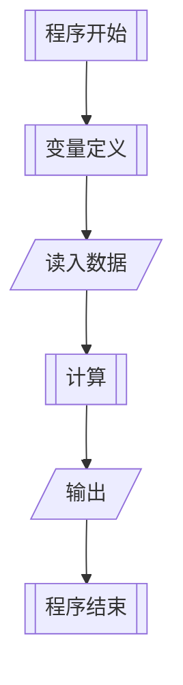
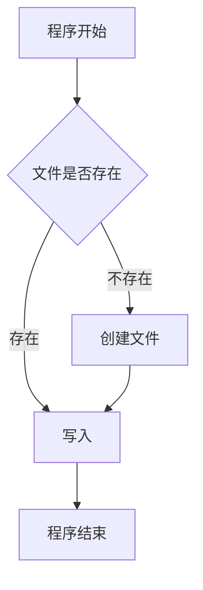
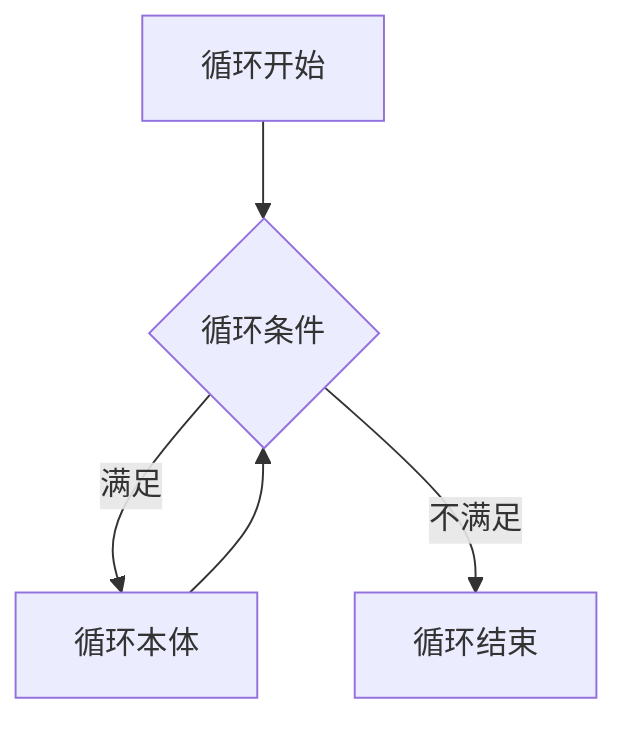

# 程序的基本执行流程

最复杂的程序也只有三种基本执行结构：
1. 顺序
2. 分支
3. 循环

## 顺序结构

如字面意思，顺序结构的程序执行方式是==自上而下，自左向右==（这里的左右指的是按照逗号的分隔，如果是一个表达式，那么按照运算符优先级）的执行

这也是程序中最简单，并且使用最多的执行结构，例如上次求解三角形面积的程序（或者说前面教你们的所有程序），其基本执行流程如下



## 分支结构（选择）

分支结构常常用于判断某些条件，并且当这些条件成立的时候才执行某一些操作，例如我们尝试向一个文件里面写入内容，当文件存在时，直接写入，不存在时，先创建再写入（你显然不能往空气中写内容），过程如下



常用的分支语句有下列3种，if…else，if…else if…else，switch…case

### 条件判断

在C++中，你可以做一下判断：

| 名称 | 符号 |
|---|---|
| 不等于 | ! =(!=) |
| 等于 | = =(\=\=) |
| 大于 | > |
| 大于等于 | > =(>=) |
| 小于 | < |
| 小于等于 | < =(<=) |

鉴于字体问题，上方的符号是分开打的，实际没有中间的空格

上方的所有符号均是连接左右两个表达式，只有当左右表达式满足条件后，才会返回“真”（非零），否者返回“假”（零）

### if - else
```cpp
    if(/*条件*/) {
        //语句1
    }
    else {
        //语句2
    }
```

在if…else中
条件可以是任何能够得出整数值的表达式

当且仅当条件为真或者数值非零时（实际上是判断的数字非零，包括负数），才会进入if语句内部执行。否者即为假，将进入else语句

如果在不满足条件是不需要执行任何操作，则可以不用写出else语句

比如刚才写文件的例子：

```cpp
if(某个文件A存在) {
	写文件A;
}
else {
	创建文件A;
	写文件A;
}
```

当然，else的内容是可以省略的，例如：

```cpp
if(某个文件A不存在) {
	创建文件A;
}
写文件A;
```

### if - else if - else
当我们想要判断多个条件是否成立的时候，我们应该如何做呢？

这时我们同样可以使用 if - else，不过我们需要稍稍改动一下，这个过程我们成为 if - else 的嵌套

```cpp
    if (/*条件1*/)
    { /*.... */
    }
    else if (/*条件2*/)
    { /*....*/
    }
    else if (/*条件3*/)
    { /*....*/
    }
    else
    { /*....*/
    }
```

实际上可以看成是下列代码的化简形式：

```cpp
if (/*条件1*/)
{
     /*.... */
}
else
{
    if (/*条件2*/)
    {
         /*....*/
    }
    else
    {
        if (/*条件3*/)
        {
             /*....*/
        }
        else
        {
             /*....*/
        }
    }
}
```

### switch - case

这种判断在代码中使用的较少（有可能在你本科四年，语法阶段就是你唯一使用这种条件语句的时间了）

```cpp
switch (/*变量*/)
{
case /*常量1*/:
    //操作1
    break;
case /*常量2*/:
    //操作2
    break;
    //case ...:
    default:
}
```

Switch后面的括号里面要求填入一个 整型常量/整型变量/整型表达式

Case后面要求空一格写出对于switch的变量为何值

当且仅当变量值与case的常量值相等时，才会执行case的内容，否者向下寻找下一个case是否满足，直到遇到default（默认执行）

与else一样，default可以不用写出，但是每一个case后面执行完操作一定记得要写break，否者可能导致错误

对于case后面的break，其与switch的原理有关

Switch其实描述的值一段**开关序列**，当某一个条件满足时，这个开关就会打开。当开关打开时，执行剩余的语句（顺序结构）

但是，这个开关只能够被打开而不能自动的关闭，所以当某一个case成立后，这个开关将一直处于被打开的状态，于是会执行完全部的语句，所以我们要使用break，即跳出switch语句，以免不必要的麻烦

下方将以代码形式来验证switch的实现方式

```cpp
int a = ? ? ? ;
switch (a)
{
case 1:
    printf("Case1\n");
    break;
case 2:
    printf("Case2\n");
    break;
case 3:
    printf("Case3\n");
default:
    printf("Default\n");
}
```

可以赋予 a 不同的值来观察程序的行为

## 循环结构

同样按照字面理解，循环结构就是让代码重复的干一件事情，直到满足了某些条件后就跳出这个循环，执行其他的操作，这个条件可以是循环的次数、计算的结果等等，流程基本如下



### while

While循环是最直接的，也是最常用的

```cpp
while(/*循环边界条件*/)
{
	//循环本体
}
```

其while后面的括号中需要填入一个值或者表达式

当且仅当这个值或者表达式为0（假）的时候，循环才停止，否者将一直执行

### do - while

do…while和while及其相似，唯一区别就是无论当前循环是否满足条件，循环体都能够被执行至少一次

```cpp
do
{
	//循环本体
}while(/*循环边界条件*/);
```

注意，while 后面有一个分号

### for

对于新手来说，for循环是最难的，但其也是最方便，变化最多的

for后面紧跟3句语句，循环变量定义是最开始被执行的，执行完后会紧接着执行循环条件的判断，若满足，则进入循环体，当一次循环完成后，循环变量语句会被执行一次，然后又紧接着执行循环条件的判断，如此重复，直到循环条件不满足是就跳出循环

```cpp
for (/*循环变量定义*/; /*循环条件*/; /*循环变量变化*/)
{
        /*循环体*/
}
```

当然，这只是一种为了保持可读性而制定的一种推荐写法

for循环的3个语句，除第二句要返回值外，其他可以是任意表达式（或者带有返回值的函数），并且你可以省略三个部分的任意部分

你也通过 for 循环的这个特性，写出很短但是"屎"一样的代码，比如以下代码可以输出一个矩阵：

```cpp
int n = 10;
for (int i = 1; (i == 1 || printf("\n")) && i <= n; i++)
    for (int j = 1; j <= n && printf("%c", j <= i ? ('*') : ('.')); j++);
```

输出的矩阵如下：

```txt
*.........
**........
***.......
****......
*****.....
******....
*******...
********..
*********.
**********
```

很短，但是很丑，极其不具有可读性

**注意，你的代码中一定要避免出现上述写法，这里只是作为演示(~~炫技~~)而书写，因为这个代码的正确性实际上是得不到任何保证，很有可能因为一个小错误造成严总后果，并且对于后期来说基本不具有调试能力**

### 基础应用：

例如我们要计算1~100的累加和，我们除了使用公式外，还可以使用循环暴力解决，其3种循环的代码如下：(ans记录结果)

```cpp
int ans = 0;
int number = 1;
while (number <= 100)
{
    ans += number;
    number++;
}
```

```cpp
int ans = 0;
int number = 1;
do {
    ans += number;
    number++;
} while (number <= 100);
```

```cpp
int ans = 0;
for(int number = 1; number <= 100; number++)
	ans += number;
```

可以看到，for 循环的使用能极大的减少我们代码总量

### 循环的跳出与跳过

当我们真正在写程序的时候，会发现在大的循环过程中，还有一些小的细节会影响到我们的循环，这时我们就需要对于当前循环跳过（continue）和直接跳出这个循环（break）这两个操作来辅助我们简化代码

特别要区分，continue只是跳过了这一次循环的剩余部分，如果下一次循环的条件还满足，依然会执行这一个循环

break是直接跳出了循环，无论下一次是否还能够满足循环条件，都不会再执行这一个循环了

## 跳转语句 goto

如果你了解一点点汇编的知识，你会发现，计算机底层其实是没有提供多行的条件或者循环这样的结构，其仅仅提供了判断和 jmp 语句

这里的 jmp 也就是我们的 goto

```cpp

goto label;

//另一个地方

label:
```
goto 语句后面会空一格跟着一个标签，当执行到goto语句的时候，会立刻跳转到对应的标签处继续顺序执行，并且不会返回当前位置，标签的定义要求和变量一样

注意，大量的goto语句会使代码变得极其不具有可读性和逻辑性，在写代码时，应当尽量避免使用 goto （为了避免你们不必要的麻烦，也为了避免我们不必要的麻烦，这里统一规定：只在需要一次性跳出多层循环的时候才使用 goto，其他时候严禁使用 goto ！！！）

